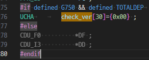

# VS 6.0 프로젝트를 VS Code에서 개발하기

# 0. 준비물
  - VS 6.0의 프로젝트는 이미 있다.
  - VS Code를 DownLoad 받아서 설치한다. <https://code.visualstudio.com/download#>
  - 은행에 반입하는 경우 User Installer를 Download받는다.
  - Plug-In (Extensions) 은 아래와 같다.
    > EditorConfig for VS Code\
    > C/C++\
    > C/C++ Extension Pack\
    > C/C++ Themes
  - OFF-Line에서 Plug-In설치는 .vsix를 확장자로 설치가능하다.
    <https://marketplace.visualstudio.com/vscode> 에서 검색하여  
    
  - .vsix설치는 아래의 그림처럼 하면 된다  
    

# 1. VS Code를 관리자권한으로 실행한다.
  - .dsp화일 및 .c 화일이 있는 폴더를 열기
  - &lt;Ctrl> + '`'(BackTick)로 Terminal을 열기, 즉, command로 Compile한다.
    ```cmd
    > dir *.dsp
    > msdev kiupART9100.dsp /MAKE /CLEAN
    > msdev kiupART9100.dsp /MAKE
    ```
    *여기서,  >는 Command창의 Prompt를 뜻한다.*

# 2. VS Code의 장점
  - 공짜다.
  - 다른 회사에서 많이들 사용한다.
  - MS에서 만들었다. C/C++ Extension도 MS에서 만들었다. 즉, Visual Studio 2022에서도 호환된다.
  - Java Doc 처럼 주석을 넣으면.. 아래와 같이 된다.
    - define에 대하여 주석  
        

    - functionde에 대하여 주석  
        
      */// Triple Slash를 하면.. 함수 바로 위줄에서 하면.. @어쩌구는 자동생성*

  - VS Code 바로가기 키(Hot Key)는\
    <https://github.com/zhangsob/Editor.html> 에서\
    editor.html을 받아서 보시면 좋습니다.

## 2-1. define 즉, -D 선언하기 (즉, #ifdef) 설정하기
    
  - -DG750 -DTOTALDEP 를 VSCode C/C++에 설정하기
      

    *&lt;Shift>+&lt;Ctrl> + P 하여*

      ```
      > C/C++: Edit
      ```
    ```json
    {
        "configurations": [
            {
                "name": "Win32",
                "includePath": [
                    "${workspaceFolder}/**"
                ],
                "defines": [
                    "_CRT_SECURE_NO_WARNINGS",
                    "WIN32",
                    "_WINDOWS",
                    "LANLAN",
                    "KM20",
                    "G750",
                    "TOTALDEP",
                    "G9100",
                    "_MBCS",
                    "_DEBUG"
                ],
                "compilerPath": "cl.exe",
                "cStandard": "c99",
                "cppStandard": "c++11",
                "intelliSenseMode": "windows-msvc-x64"
            }
        ],
        "version": 4
    }
    ```
    
    
# 3. 누구는 4 TAB, 누구는 8 TAB
  - EdidtorConfig(.editorconfig화일) 로 TAB설정하기.  
    *<https://editorconfig.org/>*
