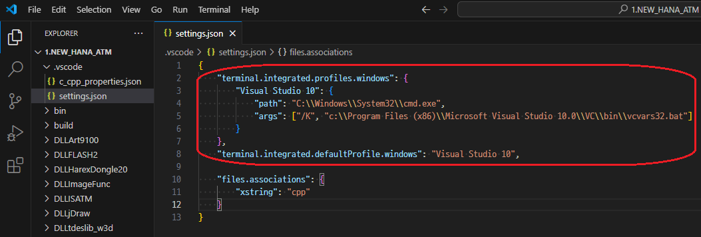
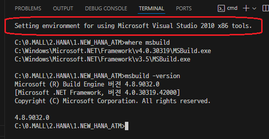
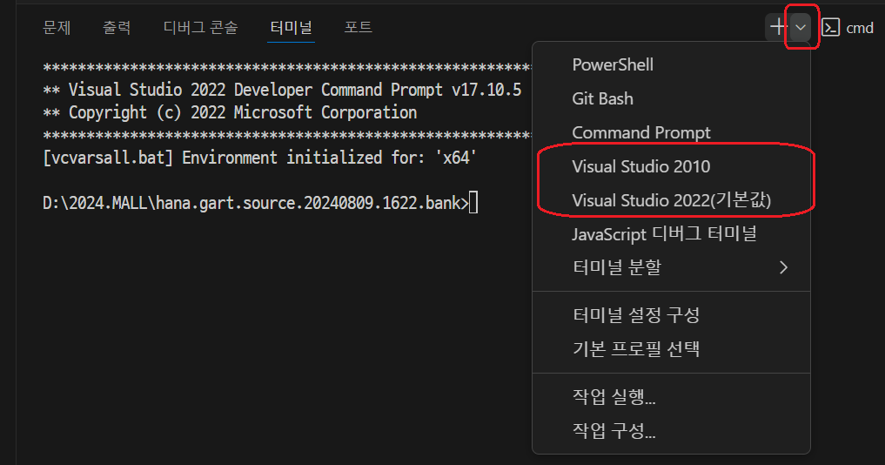

# MSBuild사용하기 (VS2010기준)
## 1. VSCode에서 프로젝트를 폴더에 아래와 같은 설정을 한다.
  ```json
  {
    "terminal.integrated.profiles.windows": {
        "Visual Studio 2010": {
            "path": "C:\\Windows\\System32\\cmd.exe",
            "args": ["/K", "c:\\Program Files (x86)\\Microsoft Visual Studio 10.0\\VC\\bin\\vcvars32.bat"]
        }
    },
    "terminal.integrated.defaultProfile.windows": "Visual Studio 2010"
  }
  ```
  *.vscode/setting.json* 에 위과 같이 설정한다.\
  Visual Studio 2010의 vcvars32.bat를 실행해야 msbuild를 사용할 수 있다.

  

## 2. &lt;Ctrl>+`으로 Terminal 열기
  

## 3. Terminal에서 아래와 같이 Compile하기
  ```command
  > dir *.vcxproj
  > msbuild gartmain.vcxproj
  > msbuild gartmain.vcxproj /t:clean
  > msbuild gartmain.vcxproj /t:build
  > msbuild gartmain.vcxproj /t:rebuild
  > msbuild -help
  > msbuild gartmain.vcxproj -t:clean
  > msbuild gartmain.vcxproj -t:build
  > msbuild gartmain.vcxproj -t:rebuild
  ```

## 4. VS2022도 .vscode/settings.json을 설정하면 된다.
  ```cmd
  C:\>dir vcvars*.bat /s
   C 드라이브의 볼륨에는 이름이 없습니다.
   볼륨 일련 번호: 7ACC-871D

   C:\Program Files\Microsoft Visual Studio\2022\Community\VC\Auxiliary\Build 디렉터리

   2024-08-01  오후 10:25                39 vcvars32.bat
   2024-08-01  오후 10:25                39 vcvars64.bat
   2024-06-01  오전 07:05            10,524 vcvarsall.bat
   2024-08-01  오후 10:25                43 vcvarsamd64_x86.bat
   2024-08-01  오후 10:25                43 vcvarsx86_amd64.bat
                 5개 파일              10,688 바이트
  ```
  *실행할 bat를 찾기*
  ```json
  {
      "terminal.integrated.profiles.windows": {
          "Visual Studio 2010": {
              "path": "C:\\Windows\\System32\\cmd.exe",
              "args": ["/K", "c:\\Program Files (x86)\\Microsoft Visual Studio 10.0\\VC\\bin\\vcvars32.bat"]
          },
          "Visual Studio 2022": {
              "path": "C:/Windows/System32/cmd.exe",
              //"args": ["/K", "C:/Program Files/Microsoft Visual Studio/2022/Community/VC/Auxiliary/Build/vcvars32.bat"]
              "args": ["/K", "C:/Program Files/Microsoft Visual Studio/2022/Community/VC/Auxiliary/Build/vcvars64.bat"]
          }
      },
      "terminal.integrated.defaultProfile.windows": "Visual Studio 2022"
  }
  ```
  *.vscode/settings.json* 에 Terminal설정하기
  

